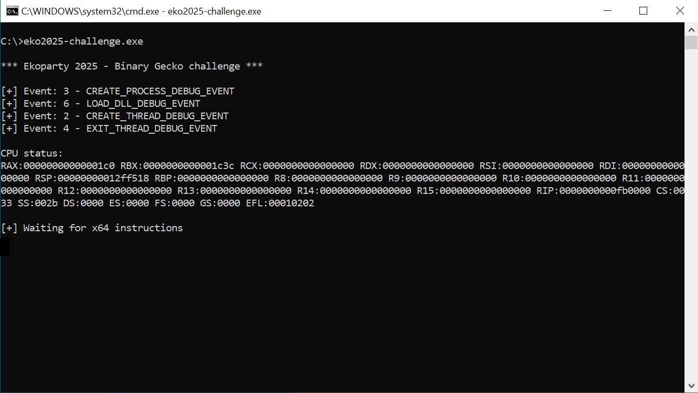

<h1 align="center">Escape from the 'virtual' Intel x64 CPU</h1>

A basic Intel x64 "virtual" cpu has been written for Windows.

This implementation was designed to remotely execute *single* user mode instructions for testing purposes.

All CPU instructions are *always* executed at the same virtual address.

## Goal:
Break this schema and get real code execution.

Tip: you can use AI to help you, if you wish.  

## Expected solutions:
- Execute a Calculator/Notepad
- Python code only (without using external libraries)
- Working on Windows 10 and/or Windows 11

